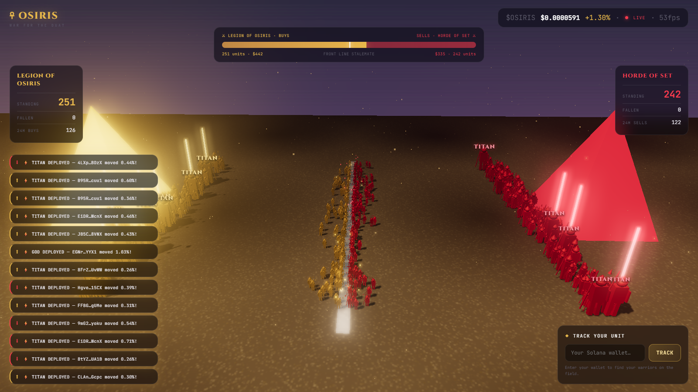
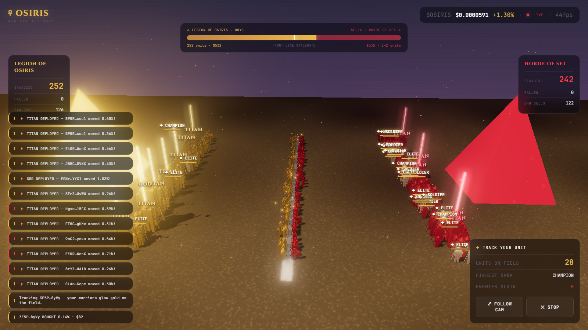

<div align="center">

# ☥ OSIRIS · War for the Duat

**A real-time 3D battlefield of $OSIRIS buys vs sells.**

Every trade is a warrior. Every wallet fights. Tune in and watch the war.

[](https://kit.svelte.dev)
[](https://threejs.org)
[](https://solana.com)



</div>

---

## The concept

Inspired by the viral "Bitcoin bulls vs bears" battle — rebuilt for **$OSIRIS** and cranked up.

The live on-chain trade tape is turned into a 3D war:

- 🟡 **Legion of Osiris** — every **BUY** spawns a golden warrior charging from the west.
- 🔴 **Horde of Set** — every **SELL** spawns a crimson warrior charging from the east.
- The two armies collide at a **front line** that surges back and forth based on real buy vs sell power. When one side dominates, its line pushes toward the enemy pyramid.

It's a shared broadcast: every viewer pulls the same synchronized trade feed, so everyone watches the same battle unfold.

## ⚔ Every wallet is a unit

Each warrior is sized by **the share of circulating supply that trade moved** — so whales tower over the field:

| Rank | Share of supply moved |
| --- | --- |
| 𓀀 **SOLDIER** | &lt; 0.01% |
| 𓆃 **ELITE** | 0.01% – 0.05% |
| 𓋹 **CHAMPION** | 0.05% – 0.25% |
| 𓉔 **TITAN** | 0.25% – 1% |
| 𓂀 **GOD** | 1%+ (screen-shaking, named on the field) |

## ◆ Track Your Unit



Paste your wallet and your warriors **glow gold**, get name-tagged with live HP bars, and a panel tracks your **units on field · highest rank · enemies slain** in real time. Hit **Follow Cam** and the camera locks onto your champion in the thick of battle.

## Features

- **Real-time 3D** — three.js with instanced armies (up to ~900/side), dynamic shadows, ACES tone mapping, and an UnrealBloom pass for that molten-gold glow.
- **Live tug-of-war front line** driven by real buy/sell power.
- **War Meter** — live buy vs sell pressure + front-line status (PUSHING SET ▶ / STALEMATE / ◀ OSIRIS FALLING BACK).
- **Killfeed** — real wallets deploying real trades, with ⚡ TITAN/GOD DEPLOYED call-outs.
- **Army panels** — standing troops, casualties, 24h buy/sell counts.
- **Clash particles**, marching animation, dying warriors sinking into the sand, threatened pyramids flaring as the enemy nears.
- **Live price ticker** + fps, garrison seeded from real 24h buy/sell counts so the field is never empty.

## Quick start

```bash
npm install
cp .env.example .env   # defaults work out of the box
npm run dev            # → http://localhost:5175
```

## Configuration (`.env`)

| Variable | Default | Purpose |
| --- | --- | --- |
| `OSIRIS_TOKEN_MINT` | `2nZN…pump` | $OSIRIS SPL mint (market stats + supply) |
| `OSIRIS_POOL_ADDRESS` | `G3rc…b4ce` | Liquidity pool for the live trade tape |

## Architecture

```
src/
├── lib/
│   ├── battle/
│   │   ├── engine.ts    # the 3D war: scene, instanced armies, tug-of-war
│   │   │                #   combat, particles, tracking beacons, bloom
│   │   └── tiers.ts     # wallet-unit ranks by % of supply
│   └── server/osiris.ts # mint + pool config
└── routes/
    ├── +page.svelte     # canvas + full HUD (war meter, panels, killfeed, track)
    └── api/
        ├── trades/      # live trade tape (GeckoTerminal, proxied + cached)
        └── token/       # price, market cap, circulating supply (DexScreener)
```

Data proxied server-side (no CORS, no keys in the browser). Sources: [GeckoTerminal](https://geckoterminal.com) · [DexScreener](https://dexscreener.com).

## Disclaimer

For entertainment. Not financial advice. The gods do not guarantee your bags.

---

<div align="center">

**OSIRIS INTELLIGENCE NETWORK** · [osirisai.live](https://www.osirisai.live/)

</div>
